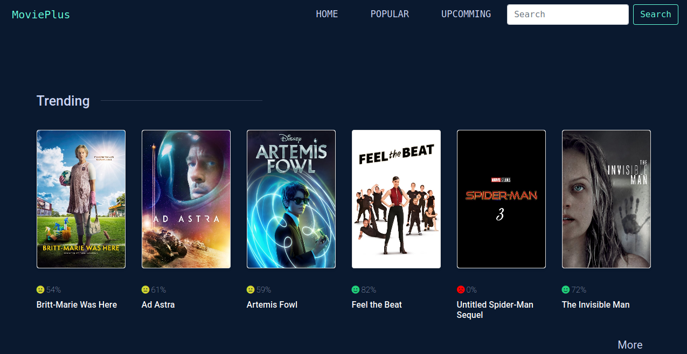

# [MoviePlus](moviepluss.herokuapp.com/)

MoviePlus is a movie application built with React and Django and hosted on Heroku. Django Rest Framework is used to fetch the data provided by the MovieDB API which is then passed on to the frontend framework. 

[Live Demo](moviepluss.herokuapp.com/)

# Features of this application:
- View popular/upcomming movies list
- Search for movies
- View movie details
- View movie ratings
- View movie trailer

   
   
  
   
   

>The data is not fetched directly from React app because environment variables in react are embedded into the build, meaning anyone can view the secret keys by inspecting your app's files. You can find the React only version of this application [here](https://github.com/beingbiplov/MoviePlus-frontend)

